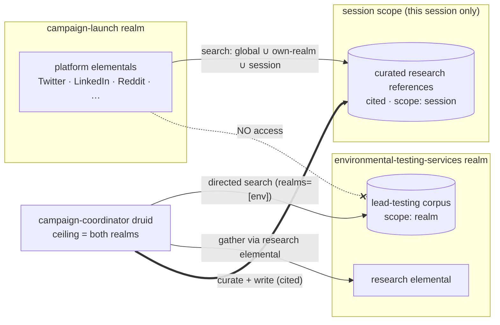

# Cross-Realm Research Composition

**Status:** Design
**Builds on:** the realm/agent model, realm-grounded WorldTree retrieval (`global ∪ traversed realms`), `research-clerk-pattern.md` (this generalizes it across realms), deterministic references (citations/provenance), session isolation (CONSTITUTIONAL).
**Scope:** How a coordination session composes knowledge from **siloed domain realms** into work produced in an **activity realm** — without co-locating knowledge, and without leaking cross-realm access to realm-bound elementals. Establishes the retrieval-scoping model (capability vs. intent), a session-scoped research namespace as the cross-realm bridge, and a deferred hook for dynamic mid-session research.

## Motivating scenario

A `campaign-launch` realm holds platform-expert elementals (Twitter/X, LinkedIn, Reddit, Hacker News, positioner) that turn a briefing into launch messaging. A customer needs that messaging grounded in **environmental / lead-testing** domain knowledge.

The wrong move is to pour that knowledge into the campaign realm. The right model: a separate **`environmental-testing-services`** realm (domain-expert/research elementals + the lead-testing corpus), usable **standalone** for research *and* **composable** into a campaign. Different customers/domains → different siloed realms, composed per session.

## The composition model

- **Domain (research) realms** — siloed knowledge + domain-expert elementals. Independently runnable; reusable across activities.
- **Activity realms** — the "doers" (e.g. campaign platform elementals).
- **A coordinator druid** granted access to the realms a given workflow spans. Its realm access is a **ceiling** (what it *may* reach), not an automatic query scope (see below).

Two-phase flow for the scenario:
1. **Gather** — the coordinator (directed by the session/system prompt) researches the domain realm(s), producing **cited references**, and writes them into a **session-scoped research namespace**.
2. **Produce** — platform elementals craft messaging; they retrieve the curated session references (grounding) via ordinary `search_worldtree`, and never touch the domain realm directly.

## Retrieval scoping: capability ≠ query intent

Today `search_worldtree` takes only `{query, limit}` and **always unions every realm the agent can reach** (`collectAgentRealms` = bound ∪ current ∪ all accessible). That sprays a broadly-capable coordinator across all its realms on every query — noisy, and it forces a **proliferation of narrowly-scoped coordinators** to control scope. This design changes that.

**Decouple the ceiling from the query:**

| Agent type | Retrieval scope | Directable? |
|---|---|---|
| **Elemental** | **Constrained** to `global ∪ boundRealm ∪ session:{current}` | **No** — cannot search other realms *at all* (not just by default). |
| **Druid / coordinator** | `global ∪ session:{current}` by default; **`+ explicitly-named realms ∩ accessibleRealms`** | Yes — the prompt names the realms to research. |

- `accessibleRealms` is the **ceiling** (travel/delegation/research capability), never the automatic query scope.
- `search_worldtree` gains an optional **`realms`** parameter. Effective scope = `global ∪ session:{current} ∪ (requested realms ∩ ceiling)` for druids; for elementals it is fixed at `global ∪ boundRealm ∪ session:{current}` and any `realms` argument beyond that is ignored/denied.
- **Direction comes from the session/system prompt** ("research the `environmental-testing-services` realm for lead-testing standards"), not from the agent's static access. → **one versatile coordinator, scoped per session by directive.**

This is the change that makes the model composable instead of requiring a bespoke coordinator per domain combination.

## The session research namespace (the cross-realm bridge)

There are two distinct "session namespaces"; only one is relevant here:
- `SessionContentManager` / `worldtree://sessions/{id}/` — coordination **step content** (contributions, publications). **Not semantically searchable.**
- The **searchable corpus** (`worldtree_documents` → `worldtree_chunks` → `worldtree_item_scopes`) — what `search_worldtree` queries. `session` is a valid scope in the model, **but retrieval currently ignores it** (the scope filter matches only `global` or `realm`).

**Design:** the gather phase writes **curated, cited research references** into the searchable corpus scoped `session:{sessionId}`, under a well-known namespace (e.g. `worldtree://session/{id}/research/`). Retrieval is extended so a session's agents include the current session scope: `… ∪ session:{current}`. Every session agent then finds the seeded research via ordinary `search_worldtree`.

**This is how knowledge crosses the realm boundary** — not by widening any elemental's realm access, but by placing a *curated* set into session scope that all session agents may read. It supersedes hand-injecting findings into each delegation prompt.

## Access control & isolation (the safety property)

The throughline: **cross-realm knowledge reaches an elemental only through the curated session references — never by granting it source-realm access.**

- **Elementals are constrained by type + binding** to `global ∪ boundRealm ∪ session`. A campaign elemental *cannot* search the `environmental-testing-services` realm even if misdirected — it has no path to it.
- **Session scope is per-session** (`scope_ref = sessionId`) → no cross-session leak; **ephemeral** → the session-scoped research must be **cleaned up when the session ends** (never persist as orphan/realm/global).
- **The shared set is deliberately curated** — only what the gather phase wrote — not a firehose of the domain realm.
- **Write-access rule:** only an agent that actually has access to the **source realm** may seed research derived from it into the session namespace, and each reference carries **provenance/citations** (the deterministic-references work). Elementals do not seed cross-realm research.

## Dynamic mid-session research (deferred, not precluded)

Research is **writes to the session namespace that can happen at any time** — not a fixed upfront phase. The substrate above already supports a mid-session research step: it writes more into the same session namespace, immediately retrievable by later steps.

What's deferred is the **signal**: how a step declares "I need research on X in realm Y." Two natural options (build when needed):
- **Knowledge gaps** — `search_worldtree` already records a gap (with target realms + query) on an empty result. A mid-session gap is a ready trigger for a research sub-phase.
- **A prompt convention** — an elemental emits a structured `RESEARCH_NEEDED: {realm, query}` marker its coordinator acts on.

**Design obligation now:** do not bake in an assumption that research is one-shot/upfront. The session namespace, directed retrieval, and coordinator gather/travel must all work equally for a mid-session research loop.

## Enabling engine changes

Modest, and both are current gaps:

1. **Session scope in retrieval** — extend the scope filter (`SCOPE_EXISTS` in `WorldTreeQueryService`) to also match `scope_type = 'session' AND scope_ref = :currentSession`, and thread the `sessionId` into the chunk search from `search_worldtree`.
2. **Directed, type-aware retrieval** — add a `realms` parameter to `search_worldtree`; change the scope assembly from "union of all accessible" to: elementals fixed at `global ∪ boundRealm ∪ session`; druids `global ∪ session ∪ (named realms ∩ ceiling)`. `collectAgentRealms` becomes a ceiling-check, not the query scope.
3. **Session-research write path** — a way for the gather phase to persist curated references as searchable, `session`-scoped corpus entries (chunked/embedded), with provenance, plus **cleanup on session end**.

## Phasing

1. **Directed retrieval (change 2)** — high value on its own: stops the all-realms spray and the coordinator-proliferation problem. Prompt-directed realm scoping.
2. **Session research bridge (changes 1 + 3)** — session-scoped searchable research + retrieval that includes it; the cross-realm gather→produce flow becomes turnkey.
3. **Dynamic research** — the signal + sub-phase loop, when a real workflow needs it.

## Open questions

- **Well-known namespace shape** — `worldtree://session/{id}/research/...`; sub-namespaces per source realm for traceability?
- **Cleanup trigger** — session completion vs. TTL; do we ever *promote* a session reference to a realm/global (operator action) if it proves broadly useful?
- **Curation UX** — is the gather phase fully coordinator-driven, or does an operator review what gets seeded before the produce phase?
- **Directed-scope ergonomics** — how the session/system prompt expresses target realms (names vs. ids), and how the coordinator maps a natural-language directive to `realms` args.
- **Interaction with the domain-bundle model** — a shared domain realm imported from a bundle (`domain-bundles.md`) is exactly a reusable research realm; the two designs should compose.
