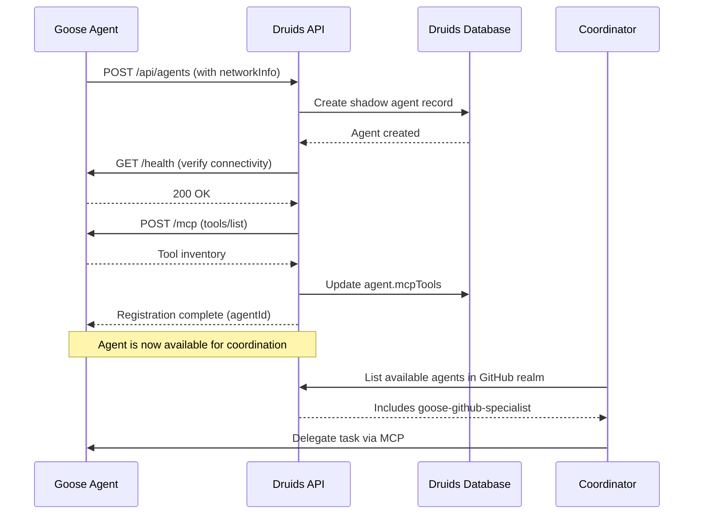

# Goose-Druids Integration Architecture

## Executive Summary

This document outlines the technical architecture for integrating external Goose agents into the Druids multi-agent orchestration system. The integration enables Goose agents to participate as first-class druids within the Druids federated realm architecture while maintaining their autonomy and existing capabilities.

**Key Principle:** Druids provides the orchestration layer that coordinates multiple Goose instances across domains, enabling complex multi-realm workflows that leverage Goose's autonomous execution strengths.

---

## Integration Vision

### The Complementary Model

```
┌─────────────────────────────────────────────────────────────────┐
│                    Druids Orchestration Layer                   │
│  ┌──────────────────────────────────────────────────────────┐   │
│  │         Coordinator (Druid) - Plans & Delegates          │   │
│  └────────────┬───────────────────┬────────────────────┬────┘   │
│               │                   │                    │        │
├───────────────┼───────────────────┼────────────────────┼────────┤
│   Realm A     │     Realm B       │     Realm C        │        │
│  ┌────────┐   │    ┌────────┐    │   ┌────────┐       │        │
│  │ Goose  │   │    │ Goose  │    │   │ In-Proc│       │        │
│  │ Agent  │   │    │ Agent  │    │   │ Druid  │       │        │
│  │(GitHub)│   │    │(Slack) │    │   │(Data)  │       │        │
│  └────────┘   │    └────────┘    │   └────────┘       │        │
│  External     │    External       │   Internal         │        │
└───────────────┴───────────────────┴────────────────────┴────────┘
         ▲                   ▲                    ▲
         │                   │                    │
    MCP Interface       MCP Interface       Direct API
```

**Example Workflow:**
```
User: "Review PR #123 and notify team on Slack with security analysis"

Coordinator:
  Step 1: Travel to GitHub Realm
  Step 2: Delegate to Goose-GitHub agent: "Review PR #123 for security issues"
  Step 3: Travel to Security Realm
  Step 4: Delegate to Security-Elemental: "Analyze findings from Step 2"
  Step 5: Travel to Slack Realm
  Step 6: Delegate to Goose-Slack agent: "Post summary referencing Steps 2 & 4"
  Step 7: Synthesize complete workflow result
```

---

## Shadow Identity Pattern

### Concept

External Goose agents are represented in Druids via **shadow identities** - Agent records that act as proxies for the external process.

### Agent Model Foundation

Druids already supports external agents via the `AgentDeployment.networkInfo` field:

```typescript
// From src/models/Agent.ts:139
networkInfo?: {
  endpoint: string;    // URL to external agent's MCP server
  protocol: string;    // "mcp-http" | "mcp-stdio" | "mcp-sse"
  port?: number;       // Optional port override
}
```

### Shadow Agent Registration

**Important Architectural Principles:**
- **Agent TYPE** determines realm behavior (coordinator, druid, elemental, etc.)
- **Agent ROLE** determines responsibilities (what the agent does)
- **Deployment location** (in-proc vs external) is independent of type
- **Coordinators are globally positioned** - they don't travel, they orchestrate
- **Druids are traveling specialists** - they can move between realms to do work
- **Clear delegation hierarchy:** Coordinators → Druids → Elementals
  - Coordinators ONLY interact with druids (never directly with elementals)
  - Druids interact with elementals within realms
  - This maintains realm isolation and prevents permission leakage
- Security is enforced via permissions, not physical location

**Example 1: External Goose Elemental (Domain-Bound Specialist)**

```json
POST /api/agents
{
  "type": "elemental",  // Elemental = bound to specific realm
  "name": "goose-github-specialist",
  "description": "Goose agent specialized in GitHub operations",
  "capabilities": ["code-review", "pr-analysis", "issue-management"],
  "specialization": {
    "domain": "github",
    "expertise": ["pull-requests", "code-review", "CI/CD"],
    "knowledgeNamespaces": ["github-apis", "git-workflows"],
    "maxConcurrentTasks": 3,
    "skillLevel": "expert"
  },
  "personality": {
    "traits": ["autonomous", "detail-oriented", "collaborative"],
    "communicationStyle": "technical",
    "decisionMaking": "analytical",
    "collaborationPreference": "autonomous"
  },
  "deployment": {
    "realmId": "realm-github",
    "networkInfo": {
      "endpoint": "http://goose-agent-1:3100/mcp",
      "protocol": "mcp-http",
      "port": 3100
    },
    "health": "healthy"
  },
  "realmAccess": {
    "boundRealmId": "realm-github",  // Elementals bound to single realm
    "accessibleRealms": [
      {
        "realmId": "realm-github",
        "permissions": ["read", "write", "execute"],
        "grantedAt": "2025-12-31T00:00:00Z"
      }
    ],
    "currentRealmId": "realm-github",
    "allowRealmTravel": false  // Elementals don't travel
  },
  "mcpTools": [],  // Discovered via MCP protocol
  "toolPermissions": {
    "github": {
      "operations": ["read", "write"],
      "restrictions": ["no-force-push"]
    }
  },
  "llmConfig": {
    "provider": "external",  // Indicates external agent manages its own LLM
    "model": "managed-by-goose"
  },
  "metadata": {
    "externalType": "goose",
    "gooseVersion": "0.9.5",
    "connectionStatus": "connected"
  }
}
```

**Example 2: External Goose Coordinator (Global Orchestrator)**

```json
POST /api/agents
{
  "type": "coordinator",  // Coordinator = globally positioned orchestrator
  "name": "goose-coordinator-main",
  "description": "External Goose coordinator orchestrating multi-realm workflows",
  "capabilities": ["orchestration", "planning", "synthesis", "delegation"],
  "specialization": {
    "domain": "coordination",
    "expertise": ["workflow-planning", "cross-realm-orchestration", "task-delegation"],
    "knowledgeNamespaces": ["coordination-patterns", "multi-agent-workflows"],
    "maxConcurrentTasks": 10,
    "skillLevel": "expert"
  },
  "personality": {
    "traits": ["strategic", "collaborative", "analytical"],
    "communicationStyle": "concise",
    "decisionMaking": "analytical",
    "collaborationPreference": "directive"
  },
  "deployment": {
    "networkInfo": {
      "endpoint": "http://goose-coordinator:3100/mcp",
      "protocol": "mcp-http",
      "port": 3100
    },
    "health": "healthy"
  },
  // Coordinators are globally positioned - no realmAccess needed
  // Coordinators ONLY delegate to druids (not elementals)
  "coordinatorPermissions": {
    "delegationPermissions": {
      // Only druids listed here - coordinators don't interact with elementals
      "goose-security-druid": {
        "canDelegate": true,
        "canDirectTravel": true,  // Can tell this druid where to travel
        "allowedOperations": ["execute_task", "get_status"]
      },
      "goose-data-druid": {
        "canDelegate": true,
        "canDirectTravel": true,
        "allowedOperations": ["execute_task", "get_status"]
      },
      "internal-coordination-druid": {
        "canDelegate": true,
        "canDirectTravel": true,
        "allowedOperations": ["execute_task", "get_status"]
      }
      // NOTE: Elementals are NOT listed - druids work with them within realms
    },
    "realmOrchestrationPermissions": {
      "realm-github": {
        "canCoordinate": true,
        "canReadResults": true,
        "canCrossRealm": true
      },
      "realm-slack": {
        "canCoordinate": true,
        "canReadResults": true,
        "canCrossRealm": true
      },
      "realm-security": {
        "canCoordinate": true,
        "canReadResults": true,
        "canCrossRealm": true
      }
    }
  },
  "coordinatorConfig": {
    "strategy": "hierarchical",
    "availableStrategies": ["hierarchical", "consensus", "auction"],
    "maxParallelDelegations": 10,
    "synthesisModel": "gpt-4",
    "externalStrategy": true  // Coordination logic in external Goose agent
  },
  "mcpTools": [],
  "toolPermissions": {
    "delegate_task": {
      "operations": ["execute"]
    },
    "direct_travel": {
      "operations": ["execute"]
    },
    "synthesize_results": {
      "operations": ["execute"]
    }
  },
  "llmConfig": {
    "provider": "external",
    "model": "managed-by-goose"
  },
  "metadata": {
    "externalType": "goose",
    "gooseVersion": "0.9.5",
    "connectionStatus": "connected"
  }
}
```

**Example 3: External Goose Druid (Traveling Specialist)**

```json
POST /api/agents
{
  "type": "druid",  // Druid = traveling specialist
  "name": "goose-security-auditor",
  "description": "Goose druid specialized in cross-realm security auditing",
  "capabilities": ["security-audit", "vulnerability-assessment", "compliance-review"],
  "specialization": {
    "domain": "security",
    "expertise": ["penetration-testing", "code-review", "security-architecture"],
    "knowledgeNamespaces": ["owasp", "security-patterns"],
    "maxConcurrentTasks": 3,
    "skillLevel": "expert"
  },
  "personality": {
    "traits": ["thorough", "detail-oriented", "risk-aware"],
    "communicationStyle": "technical",
    "decisionMaking": "analytical"
  },
  "deployment": {
    "networkInfo": {
      "endpoint": "http://goose-security-druid:3100/mcp",
      "protocol": "mcp-http",
      "port": 3100
    },
    "health": "healthy"
  },
  "realmAccess": {
    // Druids can travel between realms
    "allowRealmTravel": true,
    "accessibleRealms": [
      {
        "realmId": "realm-backend",
        "permissions": ["read", "execute"],
        "grantedAt": "2025-12-31T00:00:00Z"
      },
      {
        "realmId": "realm-frontend",
        "permissions": ["read", "execute"],
        "grantedAt": "2025-12-31T00:00:00Z"
      },
      {
        "realmId": "realm-infrastructure",
        "permissions": ["read"],
        "grantedAt": "2025-12-31T00:00:00Z"
      }
    ],
    "currentRealmId": "realm-backend"
  },
  "mcpTools": [],
  "toolPermissions": {
    "security_scan": {
      "operations": ["execute"]
    },
    "vulnerability_assessment": {
      "operations": ["execute"]
    }
  },
  "llmConfig": {
    "provider": "external",
    "model": "managed-by-goose"
  },
  "metadata": {
    "externalType": "goose",
    "gooseVersion": "0.9.5",
    "connectionStatus": "connected"
  }
}
```

**2. Druids Creates Shadow Identity**

- Shadow agent stored in Druids database
- `networkInfo.endpoint` points to Goose agent's MCP server
- Shadow acts as proxy for all coordination interactions

**3. Tool Discovery via MCP**

```javascript
// Druids queries Goose agent's MCP server for capabilities
const response = await mcpClient.request(gooseAgent.networkInfo.endpoint, {
  jsonrpc: "2.0",
  method: "tools/list",
  id: 1
});

// Updates shadow agent's mcpTools array
agent.mcpTools = response.result.tools.map(t => t.name);
```

---

## Bidirectional MCP Communication

### Architecture

```
┌─────────────────────────────────────────────────────────────────┐
│                  Druids Coordination Service                    │
│  ┌──────────────────────────────────────────────────────────┐   │
│  │  In-Proc Agent (Coordinator)                             │   │
│  │    - Calls delegate_task("goose-agent-1", taskDetails)  │   │
│  └──────────────────────┬───────────────────────────────────┘   │
│                         │                                       │
│                         ▼                                       │
│  ┌──────────────────────────────────────────────────────────┐   │
│  │  ExternalAgentBridge                                     │   │
│  │    - Translates delegate_task → MCP tools/call          │   │
│  │    - Manages session state for external agents          │   │
│  └──────────────────────┬───────────────────────────────────┘   │
└─────────────────────────┼───────────────────────────────────────┘
                          │ MCP HTTP/SSE
                          ▼
┌─────────────────────────────────────────────────────────────────┐
│              Goose Agent (External Process)                     │
│  ┌──────────────────────────────────────────────────────────┐   │
│  │  MCP Server (port 3100)                                  │   │
│  │    - Receives MCP tools/call requests                    │   │
│  │    - Exposes tools: execute_task, check_status          │   │
│  └──────────────────────┬───────────────────────────────────┘   │
│                         │                                       │
│                         ▼                                       │
│  ┌──────────────────────────────────────────────────────────┐   │
│  │  Goose Autonomous Execution                              │   │
│  │    - Executes task with full Goose capabilities         │   │
│  │    - Returns results via MCP response                    │   │
│  └──────────────────────────────────────────────────────────┘   │
└─────────────────────────────────────────────────────────────────┘
```

### Protocol Mapping

**Druids Built-in Tools → MCP Calls**

| Druids Action | MCP Method | Goose Receives |
|---------------|------------|----------------|
| `delegate_task(agentId, task)` | `tools/call` with tool `execute_task` | Task description, context, step references |
| `message_agent(agentId, msg)` | `tools/call` with tool `receive_message` | Message content, sender info |
| `get_task_status(taskId)` | `tools/call` with tool `check_status` | Task ID for status query |

**Example: Delegating to External Goose Agent**

```typescript
// In-proc coordinator calls
await agentService.delegateTask({
  targetAgentId: "goose-github-specialist",
  taskDescription: "Review PR #123 for security vulnerabilities",
  parameters: {
    repoUrl: "https://github.com/org/repo",
    prNumber: 123
  },
  contentReferences: ["step-2-content"]  // Previous step outputs
});

// ExternalAgentBridge translates to MCP call
const mcpRequest = {
  jsonrpc: "2.0",
  method: "tools/call",
  params: {
    name: "execute_task",
    arguments: {
      taskDescription: "Review PR #123 for security vulnerabilities",
      parameters: {
        repoUrl: "https://github.com/org/repo",
        prNumber: 123
      },
      context: {
        sessionId: "session-abc-123",
        stepId: "step-5",
        previousOutputs: {
          "step-2-content": "<content from earlier step>"
        }
      }
    }
  },
  id: "task-xyz-789"
};

// Send to Goose agent's MCP server
const response = await fetch("http://goose-agent-1:3100/mcp", {
  method: "POST",
  headers: { "Content-Type": "application/json" },
  body: JSON.stringify(mcpRequest)
});
```

### Required MCP Tools for External Agents

External Goose agents must expose these tools via their MCP server:

**1. `execute_task`**
```json
{
  "name": "execute_task",
  "description": "Execute a delegated task from Druids coordinator",
  "inputSchema": {
    "type": "object",
    "properties": {
      "taskDescription": { "type": "string" },
      "parameters": { "type": "object" },
      "context": {
        "type": "object",
        "properties": {
          "sessionId": { "type": "string" },
          "stepId": { "type": "string" },
          "previousOutputs": { "type": "object" }
        }
      }
    },
    "required": ["taskDescription"]
  }
}
```

**2. `receive_message`**
```json
{
  "name": "receive_message",
  "description": "Receive a message from another agent in the coordination",
  "inputSchema": {
    "type": "object",
    "properties": {
      "from": { "type": "string" },
      "message": { "type": "string" },
      "messageType": {
        "type": "string",
        "enum": ["query", "info", "request", "acknowledgment"]
      }
    },
    "required": ["from", "message"]
  }
}
```

**3. `check_status`**
```json
{
  "name": "check_status",
  "description": "Check the status of a previously delegated task",
  "inputSchema": {
    "type": "object",
    "properties": {
      "taskId": { "type": "string" }
    },
    "required": ["taskId"]
  }
}
```

**4. `travel_notification` (optional)**
```json
{
  "name": "travel_notification",
  "description": "Notification that coordination context is changing realms",
  "inputSchema": {
    "type": "object",
    "properties": {
      "fromRealmId": { "type": "string" },
      "toRealmId": { "type": "string" },
      "reason": { "type": "string" }
    }
  }
}
```

---

## ExternalAgentBridge Implementation

### Service Architecture

**New Component:** `src/services/ExternalAgentBridge.ts`

```typescript
/**
 * Bridge between Druids coordination and external MCP-compliant agents
 * Translates Druids built-in coordination tools to MCP protocol calls
 */
export class ExternalAgentBridge {
  private mcpClient: MCPClient;
  private agentService: AgentService;
  private sessionStateManager: Map<string, ExternalAgentSession>;

  /**
   * Delegate task to external agent via MCP
   */
  async delegateToExternalAgent(
    agentId: AgentId,
    task: DelegationRequest
  ): Promise<DelegationResult> {
    const agent = await this.agentService.getAgent(agentId);

    if (!agent.deployment?.networkInfo) {
      throw new Error(`Agent ${agentId} has no network endpoint configured`);
    }

    const mcpRequest = this.buildMCPRequest(agent, task);
    const response = await this.sendMCPRequest(
      agent.deployment.networkInfo.endpoint,
      mcpRequest
    );

    return this.parseMCPResponse(response);
  }

  /**
   * Send message to external agent
   */
  async messageExternalAgent(
    agentId: AgentId,
    message: AgentMessage
  ): Promise<void> {
    const agent = await this.agentService.getAgent(agentId);

    const mcpRequest = {
      jsonrpc: "2.0",
      method: "tools/call",
      params: {
        name: "receive_message",
        arguments: {
          from: message.senderId,
          message: message.content,
          messageType: message.type
        }
      },
      id: uuidv4()
    };

    await this.sendMCPRequest(
      agent.deployment!.networkInfo!.endpoint,
      mcpRequest
    );
  }

  /**
   * Health check for external agent
   */
  async checkExternalAgentHealth(agentId: AgentId): Promise<boolean> {
    try {
      const agent = await this.agentService.getAgent(agentId);
      const endpoint = agent.deployment?.networkInfo?.endpoint;

      if (!endpoint) return false;

      const response = await fetch(`${endpoint}/health`, {
        method: 'GET',
        timeout: 5000
      });

      return response.ok;
    } catch (error) {
      console.error(`Health check failed for ${agentId}:`, error);
      return false;
    }
  }

  private buildMCPRequest(agent: Agent, task: DelegationRequest): MCPRequest {
    return {
      jsonrpc: "2.0",
      method: "tools/call",
      params: {
        name: "execute_task",
        arguments: {
          taskDescription: task.taskDescription,
          parameters: task.parameters,
          context: {
            sessionId: task.sessionId,
            stepId: task.stepId,
            previousOutputs: this.resolvePreviousOutputs(task.contentReferences)
          }
        }
      },
      id: task.id || uuidv4()
    };
  }

  private async sendMCPRequest(
    endpoint: string,
    request: MCPRequest
  ): Promise<MCPResponse> {
    const response = await fetch(endpoint, {
      method: 'POST',
      headers: {
        'Content-Type': 'application/json',
        'MCP-Protocol-Version': '2025-06-18'
      },
      body: JSON.stringify(request)
    });

    if (!response.ok) {
      throw new Error(`MCP request failed: ${response.statusText}`);
    }

    return await response.json();
  }
}
```

### Integration with AgentService

```typescript
// src/services/AgentService.ts

export class AgentService {
  private externalAgentBridge: ExternalAgentBridge;

  async delegateTask(request: DelegationRequest): Promise<DelegationResult> {
    const agent = await this.getAgent(request.targetAgentId);

    // Check if external agent
    if (agent.deployment?.networkInfo) {
      console.log(`Delegating to external agent: ${agent.id}`);
      return await this.externalAgentBridge.delegateToExternalAgent(
        agent.id,
        request
      );
    }

    // In-proc agent delegation (existing logic)
    return await this.delegateToInProcAgent(request);
  }

  async messageAgent(
    targetAgentId: AgentId,
    message: AgentMessage
  ): Promise<void> {
    const agent = await this.getAgent(targetAgentId);

    if (agent.deployment?.networkInfo) {
      return await this.externalAgentBridge.messageExternalAgent(
        targetAgentId,
        message
      );
    }

    // In-proc messaging (existing logic)
    return await this.messageInProcAgent(targetAgentId, message);
  }
}
```

---

## MCP-UI Integration for Realm-Based Visualization

### Context-Aware UI Architecture

The Goose article mentions **MCP-UI** as an emerging trend for rich UI experiences. Druids can extend this with realm/agent/scenario-aware visualizations.

### Realm-Scoped UI Contexts

```typescript
// Realm defines available UI contexts
interface RealmUIContext {
  realmId: RealmId;
  visualizations: {
    type: 'dashboard' | 'graph' | 'timeline' | 'metrics' | 'chat';
    component: string;  // UI component identifier
    dataSource: string; // Where to fetch data
    permissions: string[]; // Who can view
  }[];
  interactiveElements: {
    type: 'button' | 'form' | 'approval' | 'selection';
    actionType: string;  // What action it triggers
    mcpTool?: string;    // Optional: MCP tool to call
  }[];
}
```

### Agent-Declared UI Capabilities

```typescript
// Agents declare what UI they can provide
interface AgentUICapabilities {
  providesUI: boolean;
  uiTypes: ('visualization' | 'interactive' | 'reporting')[];
  uiEndpoint?: string;  // For external agents: where to fetch UI components
  supportedFormats: ('html' | 'json' | 'svg' | 'react-component')[];
}
```

### Session-Based UI State

```typescript
// UI state tied to coordination session
interface SessionUIState {
  sessionId: string;
  activeVisualization?: {
    type: string;
    data: any;
    lastUpdated: Timestamp;
  };
  userInteractions: {
    timestamp: Timestamp;
    action: string;
    context: any;
  }[];
  approvalsPending: {
    stepId: string;
    requiredBy: AgentId;
    uiComponent: string;
  }[];
}
```

### Example: GitHub PR Review Visualization

```typescript
// Goose GitHub agent exposes UI via MCP-UI
{
  "mcp-ui": {
    "components": [
      {
        "id": "pr-review-dashboard",
        "type": "dashboard",
        "endpoint": "http://goose-agent-1:3100/ui/pr-review",
        "format": "html",
        "context": {
          "prNumber": 123,
          "sessionStepId": "step-2"
        },
        "data": {
          "filesChanged": 15,
          "securityIssues": 3,
          "reviewStatus": "in-progress"
        }
      }
    ],
    "interactions": [
      {
        "id": "approve-pr",
        "type": "button",
        "label": "Approve PR",
        "mcpTool": "github_approve_pr",
        "requiresApproval": true
      }
    ]
  }
}
```

### Druids UI Aggregation

Druids frontend fetches UI components from multiple agents and composes them into a unified coordination view:

```
┌─────────────────────────────────────────────────────────────────┐
│          Druids Coordination Dashboard (Session: ABC-123)       │
├─────────────────────────────────────────────────────────────────┤
│  Step 1: GitHub PR Review                   [goose-github]      │
│  ┌────────────────────────────────────────────────────────────┐ │
│  │ <iframe src="goose-agent-1:3100/ui/pr-review" />          │ │
│  │   - 15 files changed                                       │ │
│  │   - 3 security issues found                                │ │
│  │   [View Details] [Approve] [Request Changes]              │ │
│  └────────────────────────────────────────────────────────────┘ │
│                                                                  │
│  Step 2: Security Analysis                  [security-element]  │
│  ┌────────────────────────────────────────────────────────────┐ │
│  │ <SecurityMetrics from="step-1" />                          │ │
│  │   - SQL Injection risk: Medium                             │ │
│  │   - XSS vulnerability: Low                                 │ │
│  │   [Mitigate] [Ignore] [Escalate]                           │ │
│  └────────────────────────────────────────────────────────────┘ │
│                                                                  │
│  Step 3: Notify Team                        [goose-slack]       │
│  ┌────────────────────────────────────────────────────────────┐ │
│  │ <iframe src="goose-agent-2:3100/ui/slack-notification" /> │ │
│  │   Message drafted, awaiting approval                       │ │
│  │   [Edit Message] [Send Now] [Schedule]                     │ │
│  └────────────────────────────────────────────────────────────┘ │
└─────────────────────────────────────────────────────────────────┘
```

---

## Connection Management & Health Monitoring

### Registration Flow



### Health Monitoring

```typescript
// Periodic health checks for external agents
class ExternalAgentHealthMonitor {
  private checkInterval = 30000; // 30 seconds

  async monitorAgent(agentId: AgentId): Promise<void> {
    setInterval(async () => {
      const isHealthy = await this.externalAgentBridge.checkExternalAgentHealth(agentId);

      if (!isHealthy) {
        await this.handleUnhealthyAgent(agentId);
      }
    }, this.checkInterval);
  }

  private async handleUnhealthyAgent(agentId: AgentId): Promise<void> {
    // Update agent status
    await this.agentService.updateAgent(agentId, {
      status: 'offline'
    });

    // Update deployment health
    const agent = await this.agentService.getAgent(agentId);
    if (agent.deployment) {
      agent.deployment.health = 'unhealthy';
      agent.deployment.lastHeartbeat = undefined;
    }

    // Notify coordinators using this agent
    await this.notifyCoordinatorsOfAgentFailure(agentId);
  }
}
```

### Reconnection Protocol

```typescript
// Goose agent reconnects after failure
class ExternalAgentReconnection {
  async reconnect(agentId: AgentId): Promise<void> {
    const agent = await this.agentService.getAgent(agentId);

    // Verify connectivity
    const isHealthy = await this.externalAgentBridge.checkExternalAgentHealth(agentId);

    if (isHealthy) {
      // Re-discover tools
      const tools = await this.discoverAgentTools(agent);

      // Update shadow identity
      await this.agentService.updateAgent(agentId, {
        status: 'active',
        mcpTools: tools,
        deployment: {
          ...agent.deployment,
          health: 'healthy',
          lastHeartbeat: new Date().toISOString()
        }
      });

      // Resume any pending tasks
      await this.resumePendingTasks(agentId);
    }
  }
}
```

---

## Security & Isolation

### Realm-Level Access Control

**Key Security Principle:** Security is enforced through realm access policies, NOT deployment location. External agents can be druids (coordinators) or elementals (specialists) just like in-proc agents.

```typescript
// External ELEMENTAL (domain-bound specialist)
const gooseGitHubAgent = {
  type: "elemental",
  realmAccess: {
    boundRealmId: "realm-github",  // Bound to single realm
    accessibleRealms: [
      {
        realmId: "realm-github",
        permissions: ["read", "write", "execute"]
      }
    ],
    allowRealmTravel: false  // Elementals don't travel
  }
};

// External COORDINATOR (globally positioned orchestrator)
const gooseCoordinator = {
  type: "coordinator",
  // Coordinators don't have realmAccess - they're globally positioned
  // Coordinators ONLY delegate to druids (never elementals)
  coordinatorPermissions: {
    delegationPermissions: {
      "github-druid": { canDelegate: true, canDirectTravel: true },
      "security-druid": { canDelegate: true, canDirectTravel: true },
      "data-druid": { canDelegate: true, canDirectTravel: true }
      // NOTE: No elementals listed - druids work with them within realms
    },
    realmOrchestrationPermissions: {
      "realm-github": { canCoordinate: true, canReadResults: true },
      "realm-slack": { canCoordinate: true, canReadResults: true },
      "realm-security": { canCoordinate: true, canReadResults: true }
    }
  }
};

// External DRUID (traveling specialist)
const gooseDruid = {
  type: "druid",
  realmAccess: {
    allowRealmTravel: true,  // Druids can travel
    accessibleRealms: [
      {
        realmId: "realm-github",
        permissions: ["read", "write", "execute"]
      },
      {
        realmId: "realm-aws",
        permissions: ["read", "execute"]
      }
    ],
    currentRealmId: "realm-github"
  }
};
```

### Agent Type Capabilities & Interaction Rules

| Agent Type | Realm Behavior | Can Interact With | Deployment Options | Responsibilities |
|------------|----------------|-------------------|-------------------|------------------|
| **Coordinator** | 🌍 Globally available | Druids only | In-proc OR External | Orchestrates workflows, delegates to druids, synthesizes results |
| **Druid** | ✈️ Travels between realms | Coordinators, other Druids, Elementals | In-proc OR External | Bridge orchestration and execution; work with elementals in realms |
| **Elemental** | 🔒 Bound to specific realm | Druids only | In-proc OR External | Domain specialists with realm-specific tools |
| **Gaia** | ✈️ Travels between realms | All agent types | Usually in-proc | System harmony monitoring across realms |
| **Worldtree** | 🌍 Globally available | All agent types | Usually in-proc | Knowledge system accessible from all realms |

**Critical Delegation Hierarchy:**
```
Coordinator (Global)
    ↓ delegates to
Druid (Travels to realms)
    ↓ works with
Elemental (Realm-bound specialist)
```

**Why This Hierarchy:**
- **Security isolation:** Coordinators never directly access realm-specific tools/elementals
- **Permission simplification:** Coordinators only need permissions for druids, not every elemental
- **Realm encapsulation:** Realm-specific knowledge (which elementals, what tools) stays within realms
- **Clear separation:** Coordinators orchestrate strategy, druids execute tactics, elementals provide specialized expertise

**Example:**
```
✅ Correct:
Coordinator → Druid-Security: "Audit GitHub repos and Slack integrations"
  Druid-Security travels to GitHub realm
  Druid-Security → Elemental-GitHub: "Review PRs for security issues"
  Druid-Security travels to Slack realm
  Druid-Security → Elemental-Slack: "Audit bot permissions"
  Druid-Security synthesizes findings, reports to Coordinator

❌ Wrong (permission leak):
Coordinator → Elemental-GitHub: "Review PRs"
  Problem: Coordinator needs GitHub realm permissions
  Problem: Coordinator needs knowledge of GitHub realm internals
```

### Tool Permission Validation

```typescript
// Druids validates external agent tool usage
async function validateExternalAgentToolAccess(
  agentId: AgentId,
  toolName: string,
  operation: string
): Promise<boolean> {
  const agent = await agentService.getAgent(agentId);

  // Check tool permissions
  const toolPerm = agent.toolPermissions[toolName];
  if (!toolPerm || !toolPerm.operations.includes(operation)) {
    return false;
  }

  // Check realm-level tool policies
  const realm = await realmService.getRealm(agent.realmAccess!.currentRealmId!);
  const realmPolicy = realm.toolPolicies[toolName];

  return realmPolicy?.allowedOperations.includes(operation) ?? false;
}
```

### Session Isolation

External agents participate in session-isolated coordination:

```typescript
// Session state prevents cross-session contamination
interface ExternalAgentSession {
  sessionId: string;
  agentId: AgentId;
  activeTasks: Map<string, TaskState>;
  contentReferences: Map<string, string>;  // stepId -> content
  isolatedState: any;  // Agent-specific session state
}
```

---

## Value Proposition Summary

### For Goose Ecosystem

**1. Multi-Domain Orchestration**
- Coordinate multiple Goose instances across different specialized domains
- Enable complex workflows that span GitHub, Slack, Snowflake, etc.
- Each Goose agent maintains autonomy within its domain

**2. Cross-Realm Knowledge Synthesis**
- Step outputs from one Goose agent inform the next
- Coordinator synthesizes insights from multiple Goose specialists
- Knowledge flows through session-scoped content references

**3. Concurrent Coordination**
- Multiple teams/projects use the same Goose agent pool
- Complete session isolation prevents interference
- Resource limits prevent exhaustion

**4. Evolution Integration**
- Goose agents participate in self-play scenarios
- Successful coordination patterns automatically improve prompts
- Novel strategies discovered through multi-agent interaction

**5. Production-Ready Orchestration**
- Health monitoring and automatic failover
- Comprehensive audit trails
- Fine-grained access control

### For Druids Project

**1. Immediate Goose Integration**
- Leverages existing 3,000+ MCP server ecosystem
- Access to Goose's mature autonomous execution
- Community adoption through Goose user base

**2. Real-World Validation**
- Goose workflows provide test cases for coordination improvements
- Community feedback drives evolution priorities
- Production usage data for benchmarking

**3. Ecosystem Growth**
- More agents = better coordination discovery
- External agents bring specialized capabilities
- Network effects drive adoption

---

## Next Steps

1. **Implement ExternalAgentBridge** - Core service for MCP communication with external agents
2. **Define Goose MCP Tool Spec** - Standardize `execute_task`, `receive_message`, etc.
3. **Build Shadow Agent Registration API** - Allow Goose agents to register seamlessly
4. **Create Goose Integration Examples** - Sample scenarios demonstrating cross-realm coordination
5. **Develop MCP-UI Aggregation** - Frontend components for realm-based visualization
6. **Establish Health Monitoring** - Automatic detection and handling of agent failures
7. **Document Best Practices** - Guide for Goose users integrating with Druids
8. **Build Evolution Scenarios** - Self-play experiments with mixed in-proc and external agents

---

## Technical Contacts

- **Druids:** Larry McCay (lmccay@apache.org)
- **Goose Integration Lead:** [TBD - to be filled after initial contact]
- **MCP Protocol Questions:** Model Context Protocol community channels

**Last Updated:** 2025-12-31
