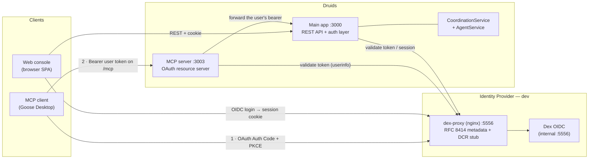

# MCP Client OAuth Integration (with the bundled Dex IdP)

**Status:** Guide
**Applies to:** the MCP **ingress** surface — external MCP clients (e.g. Goose Desktop) authenticating to the Druids MCP server.
**See also:** `mcp-authentication.md` (design), `identity-and-access-control.md` (the identity model).

This is the operational guide for connecting an OAuth-capable MCP client to Druids. The Druids MCP server is an OAuth 2.1 **resource server**: every `/mcp` call requires a bearer **user** token, and the client obtains it by running the standard MCP authorization flow against the deployment's IdP. In development that IdP is the bundled **Dex** (fronted by a small shim); in production it's a real provider (KnoxIDF, Keycloak, Google, …) and the shim is not used.

## Architecture



Two distinct client paths share one IdP:

- **MCP clients (Goose)** authenticate with an **OAuth bearer token** and call `/mcp` on `:3003`. The MCP server validates the token, binds the user to the session, and forwards that user's bearer to the main app so server-side actions are **user-scoped**.
- **The web console** uses an **OIDC login → session cookie** and calls REST on `:3000`. (It is not an MCP client — see `mcp-authentication.md`.)

Both token and session validation resolve against the same issuer, so a user is the same principal everywhere, and the existing role / assume-druid authorization applies to MCP-driven actions just as it does to the console.

## The OAuth flow (what happens on connect)

```mermaid
sequenceDiagram
    autonumber
    participant G as MCP client (Goose)
    participant M as MCP server :3003
    participant S as Dex shim :5556
    participant D as Dex
    participant U as User's browser

    G->>M: POST /mcp (initialize, no token)
    M-->>G: 401 + WWW-Authenticate: Bearer resource_metadata="…"
    G->>M: GET /.well-known/oauth-protected-resource
    M-->>G: { authorization_servers: ["…/dex"] }
    G->>S: GET /.well-known/oauth-authorization-server/dex
    S-->>G: AS metadata (+ registration_endpoint)
    G->>S: POST /register  (Dynamic Client Registration)
    S-->>G: { client_id: "goose" }
    G->>U: open authorize URL (client_id=goose, PKCE)
    U->>S: GET /dex/auth?…redirect_uri=127.0.0.1:8080/oauth_callback
    S->>D: proxy
    D-->>U: login page → user authenticates
    D-->>U: 302 → 127.0.0.1:8080/oauth_callback?code=…
    U->>G: callback delivers the code
    G->>S: POST /dex/token (code + PKCE verifier)
    S->>D: proxy
    D-->>G: access token (+ refresh)
    G->>M: POST /mcp (initialize, Authorization: Bearer …)
    M->>S: userinfo(token) → validate, resolve user
    M-->>G: 200 + Mcp-Session-Id
    Note over G,M: subsequent /mcp calls carry the bearer; the<br/>MCP server forwards it to the app for user-scoped authz
```

## The bundled Dex IdP (development)

`docker-compose` runs Dex as a dev-only OIDC provider, fronted by an nginx shim:

- **`druids-dex`** — Dex itself (internal; no host port). Issuer: `http://localhost:5556/dex`.
- **`druids-dex-proxy`** — nginx on host `:5556` (`docker/dex-proxy/`). Dex (v2.46) serves OIDC discovery only and supports neither the **RFC 8414** authorization-server-metadata URLs nor **Dynamic Client Registration** — both of which MCP clients require. The shim fills those gaps:
  - serves the AS metadata (Dex's discovery doc **+ a `registration_endpoint`**) at every URL form a client derives from the issuer;
  - answers `POST /register` with the pre-registered public **`goose`** client;
  - proxies everything else (authorize, token, keys, login) to Dex.
  The issuer is unchanged, so token validation stays consistent.

**Dev users** (in `docker/dex/config.yaml`):

| Email | Password | Roles |
|---|---|---|
| `admin@druids.dev` | `druids` | admin, user |
| `user@druids.dev` | `druids` | user |

**Pre-registered MCP client** (`goose`): public client, PKCE, redirect URIs `http://127.0.0.1:8080/oauth_callback` and the `localhost` equivalent.

## Configuring an MCP client — Goose Desktop

1. **Add the extension** (Goose → Extensions → Add):
   - **Type:** `HTTP`
   - **Endpoint:** `http://localhost:3003/mcp`
   - **Request Headers:** leave **empty** — do **not** add an `Authorization` header. OAuth is dynamic; a static header would short-circuit it.

2. **Pin the OAuth callback port to 8080.** Dex requires an *exact* redirect URI (it doesn't honor the loopback-any-port rule), and Goose otherwise uses a **random** port. Set `GOOSE_OAUTH_CALLBACK_PORT=8080`.

   ⚠️ **It must be in Goose's *own* process environment** — **not** the extension's "Environment Variables" field (that feeds spawned MCP *servers*, not the Goose app). On macOS, a Dock-launched app doesn't inherit your shell, so:
   ```bash
   launchctl setenv GOOSE_OAUTH_CALLBACK_PORT 8080
   # then fully quit (⌘Q) and relaunch Goose
   ```
   (Or launch the Goose binary from a terminal that has the variable exported — `open -a` does not pass env.)

3. **Use a tool / connect.** Goose runs the flow above, opens a browser for the Dex login (`admin@druids.dev` / `druids`), captures the callback on `:8080`, and connects. Actions you trigger are scoped to that user's roles and assumable druids.

## Production

Point the deployment at a real OIDC provider and drop the shim:

- Set `OIDC_ISSUER` (and client credentials) to the production provider; **leave `OIDC_INTERNAL_ISSUER` unset** (it only bridges the dev Docker network).
- Do **not** deploy `druids-dex` / `druids-dex-proxy`. A real IdP (KnoxIDF, Keycloak, …) serves RFC 8414 metadata and Dynamic Client Registration natively, so MCP clients self-register — no `goose` static client and no shim needed.
- MCP clients still discover everything from the MCP server's Protected Resource Metadata; only the authorization server behind it changes.

## Troubleshooting

| Symptom | Cause | Fix |
|---|---|---|
| Client loops on `/mcp` → 401, never opens a browser | It can't complete authorization-server discovery (8414) or DCR | Ensure the shim is up; check `GET /.well-known/oauth-authorization-server/dex` → 200 and `POST /register` → 200 on `:5556` |
| Dex page: **"unregistered redirect_uri"** | Client used a port other than `8080` | `GOOSE_OAUTH_CALLBACK_PORT=8080` isn't in the app env, or it's a different client/port — pin it (and confirm in the proxy log the `redirect_uri` is `…:8080/oauth_callback`) |
| "Auth required" on initialize, no OAuth attempt | The extension isn't OAuth-capable, or a static `Authorization` header is set | Use the HTTP MCP extension, remove any `Authorization` header |
| Token accepted by the server but actions return 403 | Working as intended — user-scoped authz | The user lacks the role / assumable-druid grant; grant via the Access UI or `/api/users` |

To watch a connection attempt:
```bash
docker logs druids-dex-proxy -f   # /register, /dex/auth (client_id, redirect_uri), /dex/token
docker logs druids-mcp-server -f  # the 401 challenge and the authenticated re-connect
```
